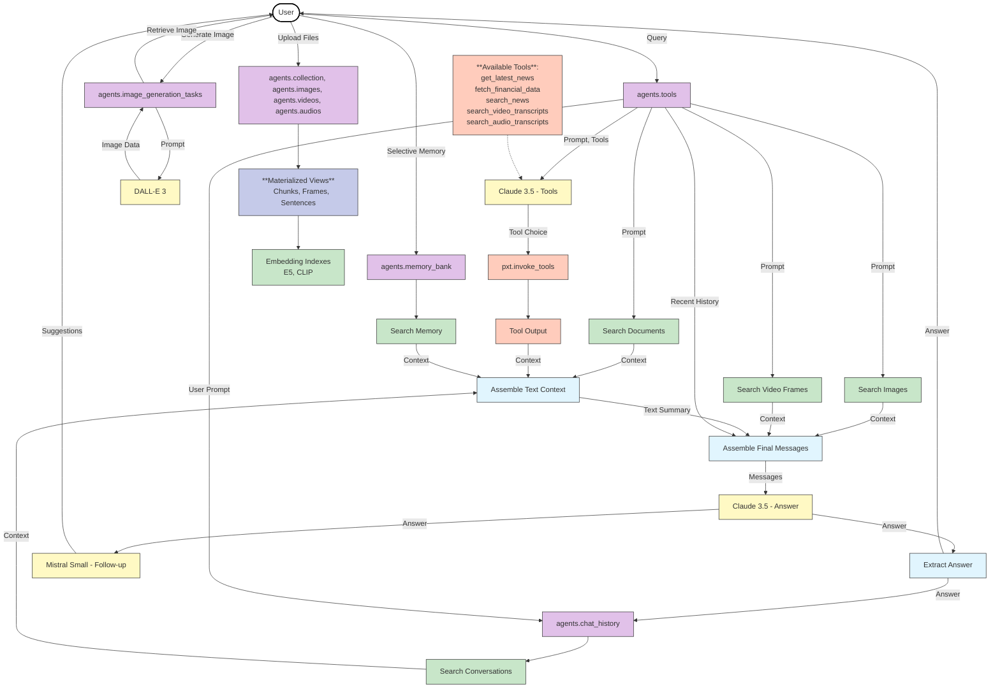

<div align="center">


[](https://opensource.org/licenses/Apache-2.0) [](https://discord.gg/QPyqFYx2UN)
<br>
</div>

[Pixelbot](http://agent.pixeltable.com/), a multimodal context-aware AI agent built using [Pixeltable](https://github.com/pixeltable/pixeltable) — open-source AI data infrastructure. The agent can process and reason about various data types (documents, images, videos, audio), use external tools, search its knowledge base derived from uploaded files, generate images, maintain a chat history, and leverage a selective memory bank.


The endpoint is built with Flask (Python) and the frontend with vanilla JS. This open source code replicates entirely what you can find at https://agent.pixeltable.com/ that is hosted on AWS EC2 instances.

## 🚀 How Pixeltable Powers This App

Pixeltable acts as AI Data Infrastructure, enabling this multimodal agent through **declarative workflows** defined in `setup_pixeltable.py`. The entire system—from data ingestion to LLM responses—uses Pixeltable **tables**, **views**, and **computed columns** that automatically manage dependencies, transformations, and state persistence.



## 📁 Project Structure

```
.
├── config.py             # Central configuration (models, prompts, personas)
├── endpoint.py           # Flask backend: API endpoints and UI rendering
├── functions.py          # Python UDFs and context assembly logic
├── setup_pixeltable.py   # Pixeltable schema definition script
├── requirements.txt      # Python dependencies
├── pyproject.toml        # Python project configuration
├── static/               # Static assets (CSS, JS, images)
│   ├── css/style.css
│   ├── js/api.js, ui.js
│   └── image/, manifest.json, robots.txt, sitemap.xml
├── templates/index.html  # Flask HTML template
├── .env                  # Environment variables (API keys, AUTH_MODE)
└── data/, logs/          # Runtime directories (created automatically)
```

## 📊 Pixeltable Schema Overview

The application uses Pixeltable's **tables** (data storage), **views** (data transformations), and **computed columns** (automatic processing) within the `agents` directory:

**Core Tables:**
- `collection`, `images`, `videos`, `audios` - Source data with auto-generated thumbnails, extracted audio
- `tools` - Main workflow orchestration with computed columns for LLM calls, context assembly, and tool execution  
- `chat_history`, `memory_bank` - User interactions and saved snippets
- `image_generation_tasks`, `user_personas` - Image creation and personalization

**Auto-Generated Views:**
- `chunks` (documents) → `video_frames` (1fps) → `audio_chunks` + `transcript_sentences` 
- All with **embedding indexes** (E5-large, CLIP) for semantic search

**Available Tools:**
- External APIs: `get_latest_news`, `fetch_financial_data`, `search_news` (UDFs)
- Internal search: `search_video_transcripts`, `search_audio_transcripts` (@pxt.query functions)

## ▶️ Getting Started

### Prerequisites & Setup

**Requirements:**
- Python 3.9+
- API keys: [Anthropic](https://console.anthropic.com/), [OpenAI](https://platform.openai.com/api-keys), [Mistral AI](https://console.mistral.ai/api-keys/), [NewsAPI](https://newsapi.org/) (optional)

**Installation:**
```bash
# 1. Create and activate virtual environment
python -m venv .venv
source .venv/bin/activate  # macOS/Linux
# .venv\Scripts\activate   # Windows

# 2. Install dependencies
pip install -r requirements.txt

# 3. Create .env file with your API keys:
```

```dotenv
# Required for core functionality
ANTHROPIC_API_KEY=sk-ant-api03-...  # Claude 3.5 Sonnet
OPENAI_API_KEY=sk-...               # Whisper + DALL-E 3
MISTRAL_API_KEY=...                 # Follow-up suggestions

# Optional
NEWS_API_KEY=...                    # NewsAPI tool

# Required to run locally
AUTH_MODE=local
```

### Running the Application

```bash
# 1. Initialize Pixeltable schema (run once)
python setup_pixeltable.py

# 2. Start the web server
python endpoint.py
```

The application will be available at `http://localhost:5000`. Data persists locally in a `.pixeltable` directory.

## 🖱️ Usage

The web interface includes:
- **Chat**: Main interaction area with chat/image generation modes, context retrieval, and memory saving
- **Settings**: Configure system prompts and LLM parameters  
- **History**: Search past conversations with execution metadata
- **Images**: View, search, and manage generated images
- **Memory**: Save and search important text/code snippets

## ⭐ Key Features

-   🔍 **Multimodal RAG**: Semantic search across documents, images, videos, and audio with automatic transcription and embedding
-   🧠 **Agentic Tool Use**: Dynamic tool selection for news/financial APIs and internal knowledge search
-   🔌 **Multi-LLM Orchestration**: Claude 3.5 (reasoning), DALL-E 3 (images), Whisper (transcription), Mistral (follow-ups)
-   💾 **Persistent Memory**: Chat history and memory bank with semantic search capabilities
-   🏠 **Local-First**: Optional local mode without authentication, customizable personas and configurations

## ⚠️ Note

This application demonstrates Pixeltable's capabilities for multimodal AI workflows. The focus is on showcasing Pixeltable patterns in `setup_pixeltable.py` and `functions.py`, while the Flask frontend serves as a functional interface rather than a web development exemplar.

For simpler Pixeltable examples with different frameworks, see the [Pixeltable Examples Documentation](https://docs.pixeltable.com/docs/examples/use-cases).
