# Pixelbot: A Reference Implementation

<div align="center">


[](https://opensource.org/licenses/Apache-2.0)
[](https://discord.gg/QPyqFYx2UN)

**Chat with your documents, images, videos, and audio files • Get live news and financial data • Generate images • Remember important conversations**

[Try Live Demo](http://agent.pixeltable.com/) • [Documentation](https://docs.pixeltable.com/)
</div>

## What is Pixelbot?

Pixelbot is an AI agent that can:
- 📄 **Answer questions** about your uploaded files (PDFs, images, videos, audio)
- 🔍 **Search and retrieve** information from news and financial APIs  
- 🎨 **Generate images** from text descriptions
- 🧠 **Remember** important snippets in a searchable memory bank
- 🎭 **Adapt** its personality with custom personas

Built on [Pixeltable](https://github.com/pixeltable/pixeltable) - open-source AI data infrastructure that handles multimodal data processing, vector search, and workflow orchestration automatically.

## How Pixeltable Powers This App

```mermaid
flowchart TD
    %% User Interaction
    User([User]) -->|Upload Files| SourceTables["📁 File Storage<br/>Documents, Images, Videos, Audio"]
    User -->|Ask Question| MainWorkflow[🤖 AI Workflow]
    User -->|Generate Image| ImageGen[🎨 Image Generation]
    User -->|Save Memory| MemoryBank[🧠 Memory Bank]

    %% File Processing & Search
    SourceTables --> AutoProcess[📊 Auto Processing<br/>Chunking, Transcription, Thumbnails]
    AutoProcess --> SearchIndexes[🔍 Search Indexes<br/>Text & Image Embeddings]
    
    %% Main AI Workflow
    MainWorkflow -->|1. Choose Tools| LLM1[🧠 Claude 3.5<br/>Tool Selection]
    LLM1 -->|2. Execute| Tools[🛠️ External APIs<br/>News, Finance, Search]
    
    SearchIndexes -->|3. Find Context| ContextAssembly[📋 Context Assembly]
    Tools -->|Tool Results| ContextAssembly
    MemoryBank -->|Relevant Memories| ContextAssembly
    
    ContextAssembly -->|4. Final Answer| LLM2[🧠 Claude 3.5<br/>Response Generation]
    LLM2 -->|5. Response| User
    
    %% Image Generation Flow
    ImageGen -->|Prompt| DALLE[🎨 DALL-E 3]
    DALLE -->|Generated Image| User
    
    %% Memory & History
    LLM2 -->|Important Info| MemoryBank
    MainWorkflow -->|All Conversations| ChatHistory[💭 Chat History]
    ChatHistory --> SearchIndexes

    %% Styling
    classDef user fill:#E3F2FD,stroke:#1976D2,stroke-width:2px
    classDef storage fill:#F3E5F5,stroke:#7B1FA2,stroke-width:2px
    classDef ai fill:#FFF3E0,stroke:#F57C00,stroke-width:2px
    classDef process fill:#E8F5E8,stroke:#388E3C,stroke-width:2px
    classDef search fill:#FFF8E1,stroke:#FBC02D,stroke-width:2px

    class User user
    class SourceTables,MemoryBank,ChatHistory storage
    class LLM1,LLM2,DALLE ai
    class AutoProcess,ContextAssembly,MainWorkflow,ImageGen process
    class SearchIndexes,Tools search
```



**Key Concept**: Everything runs as [declarative workflows](https://docs.pixeltable.com/docs/datastore/computed-columns) in Pixeltable. When you upload a file or ask a question, Pixeltable automatically handles data transformations, embeddings, API calls, and LLM orchestration based on the schema defined in `setup_pixeltable.py`.

## Quick Start

### 1. Install Dependencies
```bash
python -m venv .venv
source .venv/bin/activate  # Windows: .venv\Scripts\activate
pip install -r requirements.txt
```

### 2. Add Your API Keys
Create a `.env` file:
```env
# Required
ANTHROPIC_API_KEY=your_claude_key_here
OPENAI_API_KEY=your_openai_key_here  
MISTRAL_API_KEY=your_mistral_key_here

# Optional
NEWS_API_KEY=your_news_api_key_here

# Run locally without login
AUTH_MODE=local
```

### 3. Set Up the Database
```bash
python setup_pixeltable.py
```

### 4. Start the App
```bash
python endpoint.py
```

Visit `http://localhost:5000` and start chatting!

## Key Features

- **🤖 Smart File Processing**: Upload documents, images, videos, or audio and ask questions about them
- **🔧 External Tools**: Get live news, stock prices, and web search results  
- **💾 Persistent Memory**: Save important information that carries across conversations
- **🎨 Image Generation**: Create images with DALL-E 3 integration
- **👤 Custom Personas**: Create different AI personalities for different use cases
- **📱 Clean Interface**: Modern web UI with file management and conversation history

## File Support

| Type | Formats | Features |
|------|---------|----------|
| **Documents** | PDF, TXT, MD, HTML | Full text search, automatic chunking |
| **Images** | JPG, PNG | Visual similarity search, thumbnail generation |
| **Videos** | MP4, MOV, AVI | Frame extraction, automatic transcription |
| **Audio** | MP3, WAV, M4A | Speech-to-text, searchable transcripts |

## Need Help?

- 📖 [Full Documentation](https://docs.pixeltable.com/)
- 💬 [Join Discord Community](https://discord.gg/QPyqFYx2UN)
- 🐛 [Report Issues](https://github.com/pixeltable/pixelbot-main/issues)
- ⭐ [Star on GitHub](https://github.com/pixeltable/pixeltable)

---

*Built with ❤️ using [Pixeltable](https://pixeltable.com) - The AI Data Infrastructure*